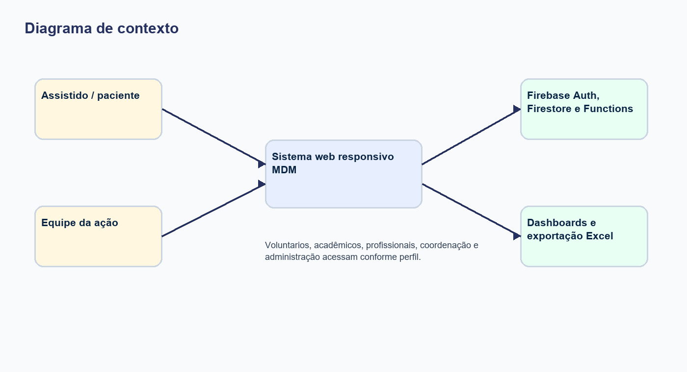
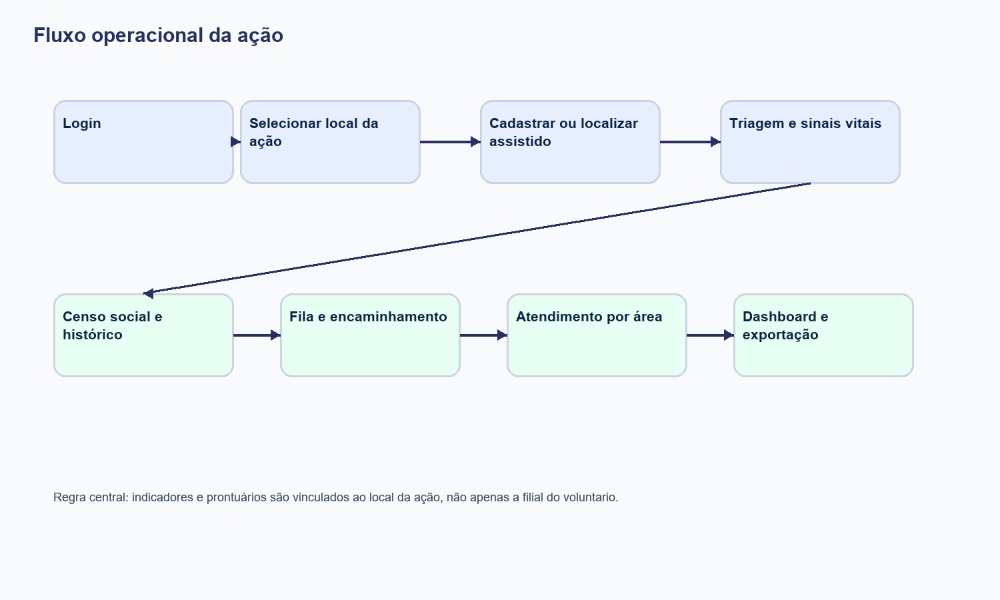
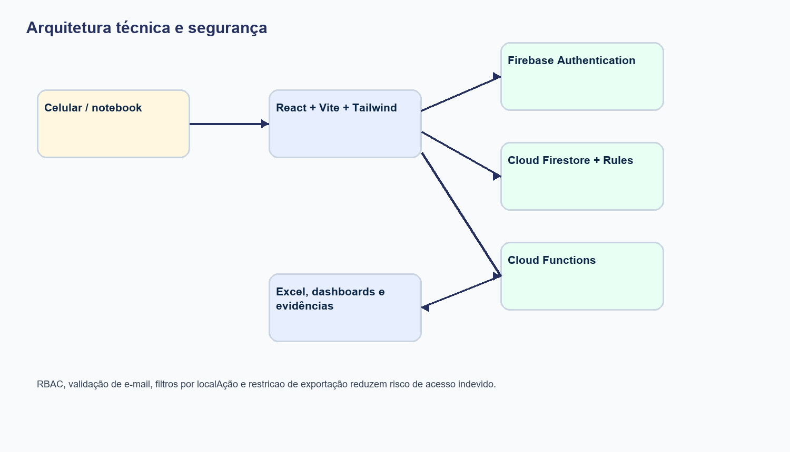
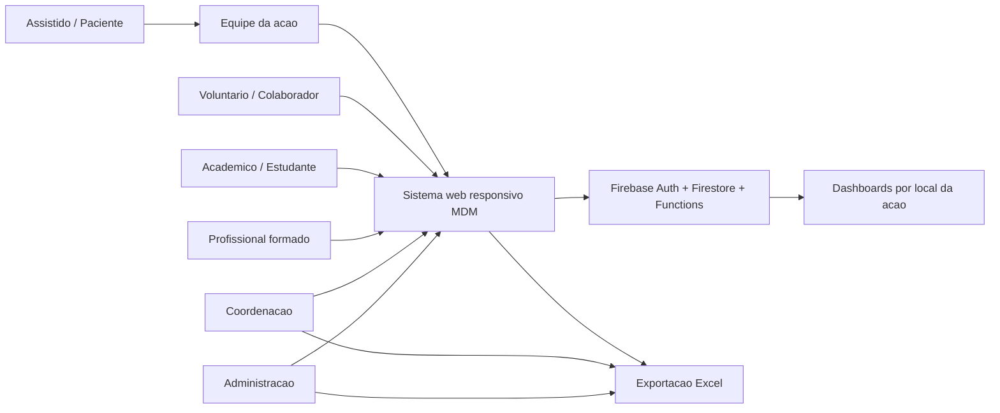
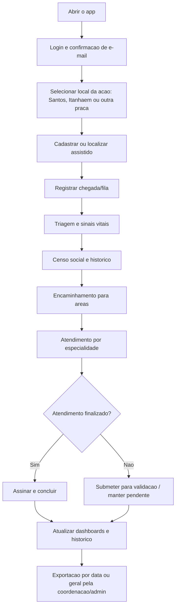
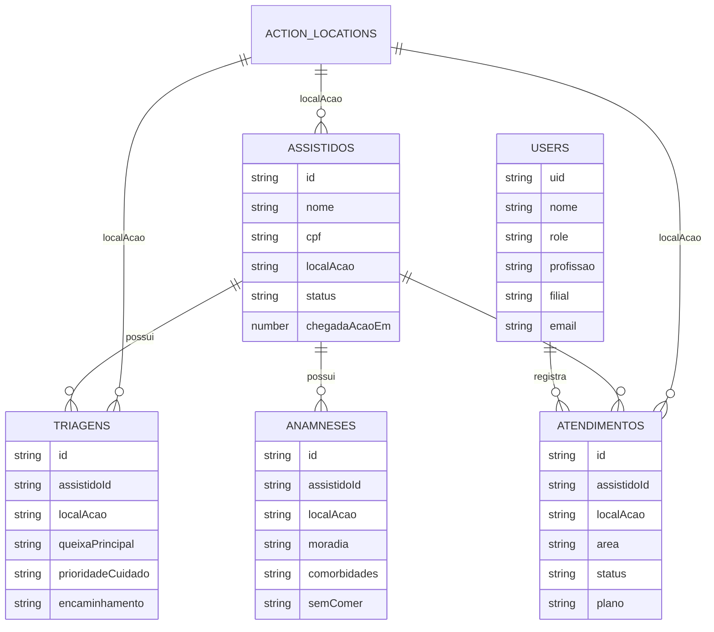
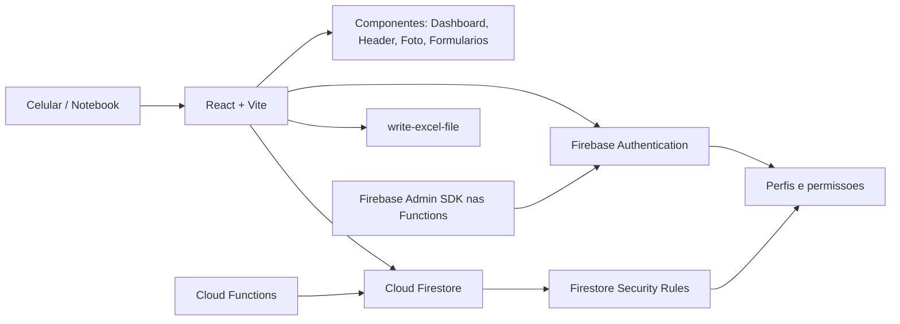

# Diagramas do Projeto

Este documento apresenta os principais diagramas do sistema desenvolvido para a Medicos do Mundo em Santos-SP e Itanhaem-SP.

## Versoes em imagem

As imagens abaixo foram geradas para uso direto no documento final em Word/PDF.

## 1. Diagrama de Contexto

## 2. Fluxo Operacional da Acao

## 3. Perfis e Permissoes

```mermaid
flowchart TB
    Admin["Administrador"] --> U["Gerenciar usuarios"]
    Admin --> E["Exportar dashboards"]
    Admin --> A["Acessar todos os registros"]
    Coord["Coordenacao"] --> E
    Coord --> A
    Coord --> R["Revogar usuarios abaixo da coordenacao"]
    Prof["Profissional formado"] --> L["Ler historico"]
    Prof --> P["Prescrever / definir conduta"]
    Prof --> C["Assinar e concluir atendimento"]
    Acad["Academico"] --> L
    Acad --> S["Preencher evolucao da area"]
    Acad --> V["Submeter para validacao"]
    Vol["Voluntario / Colaborador"] --> L
    Vol --> O["Registrar comentarios e apoio operacional"]
    Vol --> N["Cadastrar assistido e direcionar fluxo quando permitido"]
```

## 4. Modelo Simplificado de Dados

## 5. Arquitetura Tecnica

