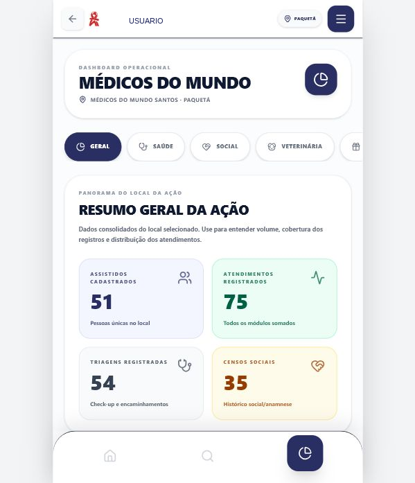
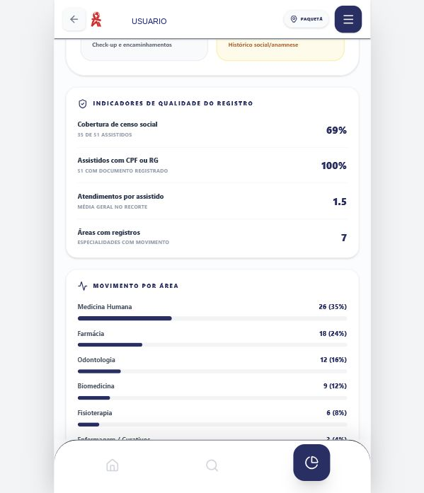
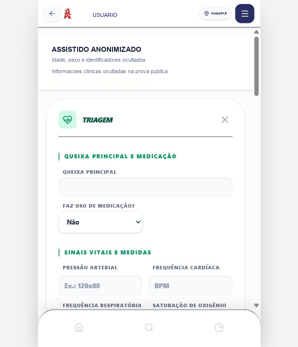
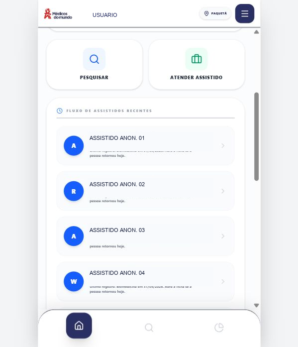
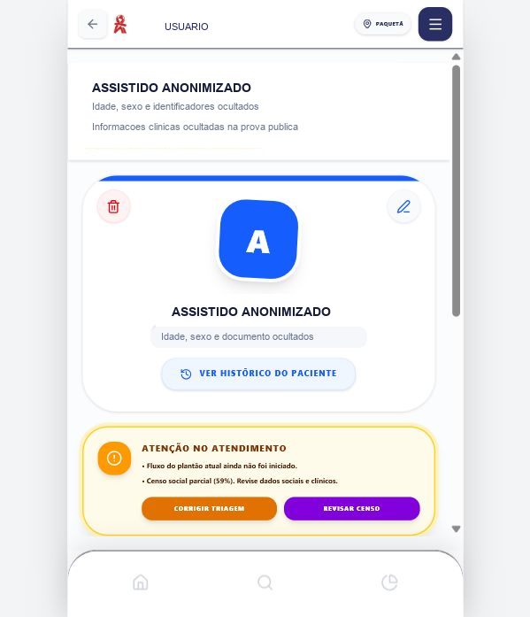
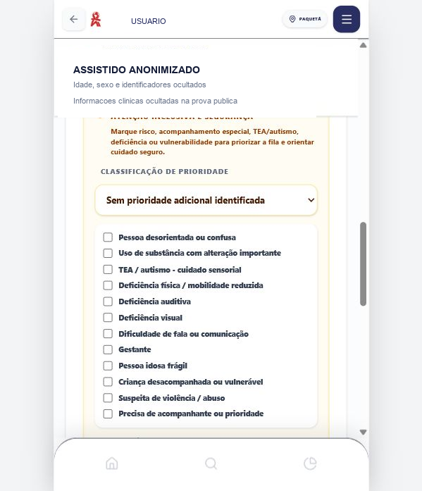
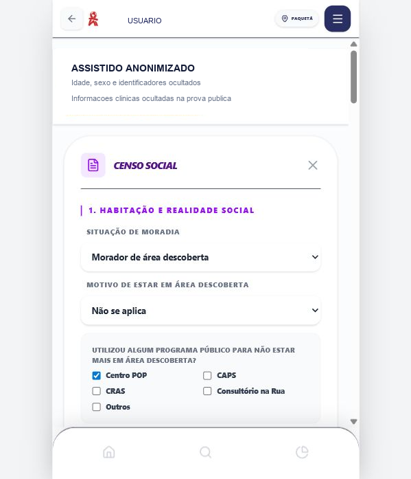
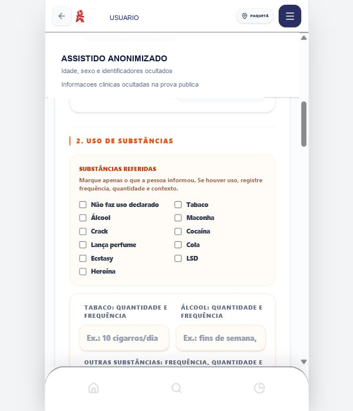

# Evidencias de Desenvolvimento e Aplicacao

As evidencias abaixo demonstram que o sistema foi desenvolvido, testado, aplicado e utilizado nas acoes da Medicos do Mundo em Santos-SP e Itanhaem-SP.

O primeiro ciclo de uso ocorreu em Santos-SP, nas acoes vinculadas a regiao do Centro POP/Paqueta. A partir do funcionamento em campo e da satisfacao dos voluntarios com a organizacao do fluxo, o sistema foi expandido para Itanhaem-SP, incluindo a localidade de Belas Artes, onde tambem passou a ser utilizado. O projeto encontra-se em fase de entrega final das versoes documentadas.

Versao publicada utilizada nas evidencias finais: [https://app-medicos.vercel.app/](https://app-medicos.vercel.app/)

> Observacao LGPD: as imagens foram sanitizadas antes de entrar no repositorio. Nomes, documentos e identificacoes de usuarios/assistidos foram ocultados.

## 1. Dashboard operacional

O dashboard consolida indicadores por local da acao, permitindo leitura rapida de assistidos cadastrados, atendimentos, triagens, censos sociais e distribuicao por area.

## 2. Indicadores operacionais

Os indicadores demonstram a consolidacao do uso do sistema: assistidos cadastrados, atendimentos registrados, areas com movimento e cobertura de censo social. Os valores exibidos foram anonimizados e filtrados por local da acao.

## 3. Tela de triagem

A triagem registra queixa principal, uso de medicacao, sinais vitais, prioridade, sinais de atencao e encaminhamento para areas de atendimento.

## 4. Fluxo e ficha do assistido

O fluxo de assistidos recentes mostra o acesso rapido aos atendimentos, com texto operacional adequado para retorno ao cuidado. A ficha concentra o cabecalho clinico, alertas, roteiro, censo e possibilidades de atendimento extra.

## 5. Priorizacao e atencao inclusiva

A triagem possui classificacao de prioridade e marcadores de cuidado para situacoes de risco, TEA/autismo, deficiencias, criancas vulneraveis, gestantes, idosos frageis e outras necessidades de acompanhamento.

## 6. Censo social

O censo social registra situacao de moradia, rede de apoio, trabalho, uso de substancias, saude sexual/reprodutiva, antecedentes clinicos, saude mental, seguranca alimentar e pets.

O bloco de uso de substancias foi ajustado para registrar nao apenas a substancia referida, mas tambem frequencia, quantidade e contexto de uso.

## 7. Evidencias tecnicas no repositorio

- Codigo React em `src/App.jsx` e componentes auxiliares em `src/components/`.
- Configuracao Firebase em `firebase.json`, `firestore.rules`, `storage.rules` e `functions/index.js`.
- Publicacao web realizada na Vercel.
- Exportacao de planilhas via biblioteca `write-excel-file`.
- Controle de acesso por perfil nas regras do Firestore e nas Cloud Functions.
- Build de producao validado com `npm run build`.
- Qualidade estatica validada com `npm run lint`.

## 8. Evidencias operacionais

Durante o desenvolvimento e a aplicacao em campo foram utilizados cadastros, triagens, atendimentos, simulacoes e registros reais de validacao para testar:

- assistidos com informacoes completas;
- assistidos com informacoes parciais;
- situacoes criticas ou de atencao especial;
- atendimento extra;
- fila de espera;
- dashboards por area;
- exportacao geral e por data;
- perfis de voluntario, academico, profissional, coordenacao e administracao.
- separacao por local da acao em Santos-SP e Itanhaem-SP.

As evidencias com dados pessoais nao foram publicadas no GitHub por seguranca e adequacao a LGPD.
