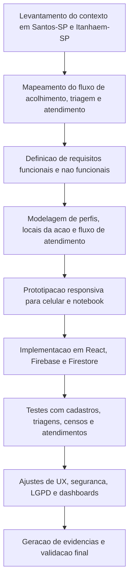

# Atividades Extensionistas - Trabalho Final

## Curso

- ( ) Bacharelado em Engenharia da Computacao
- ( ) Bacharelado em Engenharia de Software
- (x) CST em Analise e Desenvolvimento de Sistemas
- ( ) CST em Banco de Dados
- ( ) CST em Ciencia de Dados
- ( ) CST em Desenvolvimento Mobile
- ( ) CST em Gestao da Tecnologia da Informacao
- ( ) CST em Jogos Digitais
- ( ) CST em Redes de Computadores

## Disciplina

- ( ) Atividade Extensionista I: Tecnologia Aplicada a Inclusao Digital - Levantamento
- (x) Atividade Extensionista II: Tecnologia Aplicada a Inclusao Digital - Projeto
- ( ) Atividade Extensionista III: Tecnologia Aplicada a Inclusao Digital - Analise
- ( ) Atividade Extensionista IV: Tecnologia Aplicada a Inclusao Digital - Implementacao

## Etapa

- ( ) Validacao da proposta
- (x) Trabalho final

## Aluno e RU

| Aluno | RU |
| --- | --- |
| Leandro Andalaft dos Santos Junior | 4548358 |

## Titulo

Desenvolvimento de uma Ferramenta Web Responsiva para Triagem, Registro e Gestao de Atendimentos na Medicos do Mundo Santos e Itanhaem.

## Setor de Aplicacao

O projeto foi aplicado em acoes da Medicos do Mundo realizadas nos municipios de Santos-SP e Itanhaem-SP. A instituicao atua na area da saude e assistencia humanitaria, com foco em populacoes em situacao de vulnerabilidade social.

Em Santos-SP, o principal contexto de aplicacao envolveu as acoes realizadas na regiao do Centro POP, no bairro Paqueta, com apoio de voluntarios, estudantes, profissionais de saude e parceiros da rede publica. O sistema foi utilizado nesse contexto para apoiar cadastro, triagem, censo social, fluxo de atendimento e acompanhamento de indicadores. Apos o funcionamento em Santos-SP e a satisfacao relatada pelos voluntarios com a organizacao do processo, a solucao foi expandida para Itanhaem-SP, incluindo a regiao de Belas Artes, onde tambem passou a ser utilizada.

O setor de aplicacao corresponde a etapa operacional de acolhimento, cadastro, triagem, censo social, organizacao da fila e registro de atendimentos multiprofissionais durante as acoes presenciais. A ferramenta foi projetada para funcionar em celular ou notebook, com separacao dos dados por local da acao, permitindo que prontuarios, indicadores e exportacoes sejam vinculados a praca onde o atendimento ocorreu. Atualmente, o projeto esta em fase de entrega final das versoes documentadas e das evidencias anonimizadas para avaliacao academica.

A versao publicada para acesso e demonstracao encontra-se em: [https://app-medicos.vercel.app/](https://app-medicos.vercel.app/).

## Objetivos de Desenvolvimento Sustentavel (ODS)

- ( ) 01. Erradicacao da pobreza
- ( ) 02. Fome zero e agricultura sustentavel
- (x) 03. Saude e bem-estar
- ( ) 04. Educacao de qualidade
- ( ) 05. Igualdade de genero
- ( ) 06. Agua potavel e saneamento
- ( ) 07. Energia limpa e acessivel
- ( ) 08. Trabalho decente e crescimento economico
- ( ) 09. Industria, inovacao e infraestrutura
- (x) 10. Reducao das desigualdades
- ( ) 11. Cidades e comunidades sustentaveis
- ( ) 12. Consumo e producao responsaveis
- ( ) 13. Acao contra a mudanca global do clima
- ( ) 14. Vida na agua
- ( ) 15. Vida terrestre
- ( ) 16. Paz, justica e instituicoes eficazes
- (x) 17. Parcerias e meios de implementacao

## Objetivos

1. Mapear o fluxo atual de cadastro, triagem, censo social e registro de atendimentos realizados nas acoes da Medicos do Mundo em Santos-SP e Itanhaem-SP.
2. Identificar as limitacoes operacionais do processo atual, incluindo dificuldade de organizacao da fila, registros incompletos, necessidade de consulta rapida ao historico e consolidacao manual de dados.
3. Especificar requisitos funcionais e nao funcionais de uma ferramenta digital responsiva para uso por voluntarios, academicos, profissionais, coordenacao e administracao.
4. Modelar o fluxo de atendimento, os perfis de acesso e a separacao dos dados por local da acao, garantindo que os indicadores sejam vinculados ao municipio e a praca onde o cuidado ocorreu.
5. Desenvolver uma aplicacao web responsiva utilizando React, Vite, Firebase Authentication, Firestore, Cloud Functions, regras de seguranca e exportacao de dados em Excel.
6. Implantar e validar um prototipo funcional com cadastros de assistidos, triagens, censos sociais, atendimentos por especialidade, fila de espera, dashboards e exportacoes.
7. Comprovar o desenvolvimento e a aplicacao do projeto por meio de evidencias visuais, registros de uso, simulacoes, conversas de validacao e resultados obtidos no sistema.

## Metodologia

A metodologia adotada foi baseada em uma abordagem agil simplificada, combinando Kanban, prototipacao incremental e testes continuos. Essa abordagem foi escolhida por ser adequada a um projeto extensionista de curta duracao, com necessidade de evolucao rapida a partir de feedback de usuarios reais.

O processo metodologico seguiu o roteiro pratico de Engenharia de Software recomendado para a Atividade Extensionista II: levantamento de contexto, engenharia de requisitos, modelagem, desenvolvimento, planejamento minimo viavel, criterios de qualidade e evidencias de aplicacao.

### Fluxo metodologico

### Sequencia de atividades e duracao

| Etapa | Atividade | Duracao |
| --- | --- | --- |
| 1 | Levantamento do problema, contexto da ONG e locais de aplicacao | 5 dias |
| 2 | Engenharia de requisitos e definicao de usuarios/perfis | 4 dias |
| 3 | Modelagem do fluxo de atendimento e separacao por local da acao | 3 dias |
| 4 | Prototipacao das telas principais e fluxo mobile | 5 dias |
| 5 | Desenvolvimento do frontend com React, Vite e Tailwind CSS | 8 dias |
| 6 | Implementacao do backend com Firebase Auth, Firestore, regras e Functions | 6 dias |
| 7 | Implementacao dos formularios de cadastro, triagem, censo e atendimentos | 8 dias |
| 8 | Desenvolvimento dos dashboards e exportacao em Excel | 4 dias |
| 9 | Aplicacao inicial em Santos-SP, testes funcionais, simulacoes e validacao com evidencias | 6 dias |
| 10 | Expansao para Itanhaem-SP, ajustes finais de usabilidade, seguranca, LGPD e documentacao | 4 dias |

### Tecnologias utilizadas

| Tecnologia | Uso no projeto |
| --- | --- |
| React | Construcao da interface web responsiva |
| Vite | Ambiente de desenvolvimento e build |
| Tailwind CSS | Estilizacao, padronizacao visual e responsividade |
| Firebase Authentication | Login, recuperacao de senha, confirmacao de e-mail e identidade do usuario |
| Cloud Firestore | Persistencia de assistidos, triagens, censos, atendimentos, usuarios e configuracoes |
| Firebase Security Rules | Restricao de leitura/escrita por autenticacao, papel do usuario e regras de negocio |
| Firebase Cloud Functions | Operacoes administrativas e encerramento automatico de atendimentos pendentes |
| write-excel-file | Exportacao de dados e dashboards em planilhas Excel |
| Lucide React | Iconografia da interface |
| ESLint | Verificacao de qualidade de codigo |
| Vercel | Publicacao da aplicacao web |

### Requisitos funcionais implementados

- Cadastro de assistidos com dados de identificacao e dados sociais.
- Triagem com queixa principal, sinais vitais, prioridade, atencao especial, criancas e encaminhamentos.
- Censo social com moradia, programas publicos, saude, alimentacao, saude mental, antecedentes, pets e vulnerabilidades.
- Atendimentos por especialidade, incluindo medicina, odontologia, psicologia, nutricao, fisioterapia, enfermagem, vacinacao, biomedicina, farmacia, veterinaria, justica de rua, doacoes, beleza, acolhimento social, documentacao e apoio a mulher.
- Fila de espera com tempo, ordem de chegada, prioridade e atendimentos extras.
- Historico do assistido e visualizacao de registros por area.
- Dashboards gerais e por area.
- Exportacao em Excel por data ou geral.
- Controle de usuarios com perfis de voluntario, colaborador, academico, profissional formado, coordenacao e administracao.
- Selecionar local da acao para separar dados de Santos-SP, Itanhaem-SP e futuras localidades.

### Requisitos nao funcionais implementados

- Interface responsiva para celular e notebook.
- Padronizacao dos rotulos dos formularios, evitando campos sem identificacao.
- Mensagens de erro e feedback ao usuario.
- Controle de acesso para reduzir risco de exposicao de dados sensiveis.
- Filtro de dados inativos e registros de teste nos dashboards/exportacoes.
- Estrutura preparada para expansao para outras cidades.
- Cuidados de LGPD: dados pessoais tratados apenas no sistema, prints publicos anonimizados e exportacao restrita.

## Resultados Esperados/Obtidos

O resultado obtido foi um sistema web responsivo funcional para apoiar as acoes da Medicos do Mundo em Santos-SP e Itanhaem-SP. A solucao permite cadastrar assistidos, registrar triagens, preencher censo social, organizar fila de espera, realizar atendimentos multiprofissionais, consultar historico, acompanhar indicadores e exportar dados para analise pela coordenacao.

O projeto foi inicialmente aplicado e utilizado em Santos-SP. O uso em campo demonstrou funcionamento adequado para organizar o fluxo de assistidos e facilitar o trabalho dos voluntarios. A satisfacao dos voluntarios com a ferramenta e a percepcao de utilidade operacional motivaram a expansao para Itanhaem-SP, onde o sistema tambem passou a ser utilizado, respeitando a separacao de dados por local da acao.

Foram implementadas funcionalidades que atendem diretamente aos objetivos propostos:

- Cadastro estruturado de assistidos.
- Triagem com sinais vitais, encaminhamentos e indicacao de situacoes de atencao.
- Censo social e historico com campos padronizados.
- Atendimentos por especialidade com registros especificos.
- Separacao por local da acao, permitindo diferenciar Santos-SP, Itanhaem-SP e futuras localidades.
- Dashboards por area e painel geral.
- Exportacao de dados por data ou exportacao geral.
- Permissoes por perfil, restringindo exportacao e administracao a coordenacao/administracao.
- Evidencias visuais do sistema em funcionamento.
- Indicadores operacionais demonstrando assistidos cadastrados, atendimentos registrados, areas com movimento e cobertura de censo social.

As evidencias reunidas incluem prints do dashboard, indicadores, triagem, censo social, registros de atendimento, simulacoes, dados de uso e documentacao do codigo. Os prints disponibilizados no repositorio foram anonimizados para respeitar a LGPD.

### Evidencias visuais

## Consideracoes Finais

O projeto demonstrou a relevancia da tecnologia como apoio direto a acoes sociais e humanitarias. No contexto da Medicos do Mundo em Santos-SP e Itanhaem-SP, a ferramenta contribuiu para organizar atendimentos, reduzir perda de informacoes, melhorar a comunicacao entre areas e gerar dados mais confiaveis para tomada de decisao.

A aplicacao inicial em Santos-SP confirmou a utilidade da solucao em campo. A partir da satisfacao dos voluntarios e da necessidade de manter o mesmo padrao operacional em outras localidades, a ferramenta foi expandida para Itanhaem-SP e tambem utilizada nessa nova frente de atuacao. Esse resultado reforca que o projeto nao ficou restrito a uma proposta teorica, mas foi desenvolvido, aplicado, ajustado e expandido conforme a realidade da comunidade atendida.

A principal aprendizagem foi compreender que sistemas voltados a saude e assistencia social precisam equilibrar robustez tecnica e simplicidade operacional. A acao em campo nao pode ser travada por excesso de burocracia, mas tambem nao pode deixar de registrar informacoes essenciais para continuidade do cuidado.

Entre as dificuldades encontradas, destacam-se a organizacao de muitos formularios em uma interface simples, a definicao de regras de acesso sem impedir o trabalho dos voluntarios, a separacao dos dados por local da acao e a necessidade de garantir clareza visual em telas pequenas.

Como melhorias futuras, recomenda-se evoluir a aplicacao para suporte offline completo, integracao com Firebase Storage para imagens, aprimoramento de relatorios epidemiologicos e expansao controlada para outras cidades atendidas pela organizacao. No momento, o projeto segue em fase de entrega final das versoes documentadas, com a base funcional ja aplicada em Santos-SP e Itanhaem-SP.

O projeto atende aos objetivos da Atividade Extensionista II ao comprovar o desenvolvimento e a aplicacao pratica de uma solucao tecnologica voltada a comunidade local, alinhada aos ODS 03, 10 e 17.
